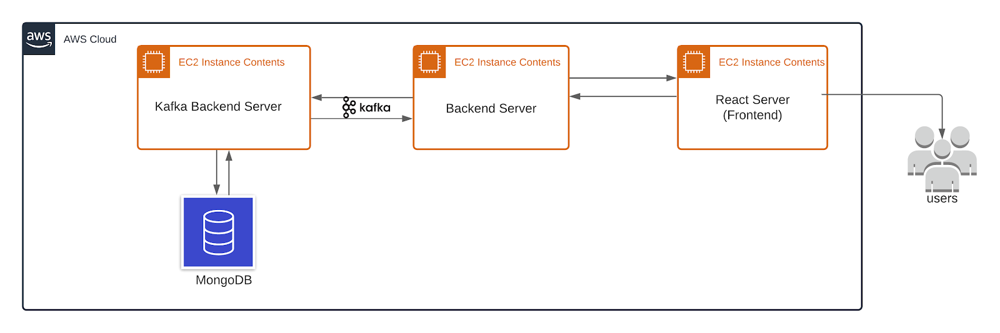

# Yelp Replica
Yelp with MongoDb and Redux and Kafka

The Purpose of this system is to enable customers and restaurants to interact with each other and perform business. The system should facilitate customers to post orders , reviews and searches whereas to facilitate restaurants to rec\eive those order requests and execute them. The restaurants should also be able to add/edit dishes to the menu and should be able to post events which customers can register to.
	The goal is to design and build a scalable,reliable and user friendly web application which has low latency and is fault tolerant. 
In this system JWT tokens are used for authentication of a user at the login page. Each component checks for the JWT token and the session id before rendering. Frontend is written using React.js which provides a superior reaction time to UI interactions. Node Js is used for Backend to handle the API calls in async manner hence making the webApp more responsive. MongoDB with connection pooling was used to store Data. Kafka messaging queue is used to scale the backend for high loads.
### Architecture


# See Demo
* [Recording](https://www.youtube.com/watch?v=nOkruj5IUjk)

### steps to run
#### inside kafka/Backend folder
```
npm i
node index.js
```
#### inside kafka/KafkaBackend folder
```
npm i
npm start
```
#### inside Frontend Folder
```
npm i
npm start
```

